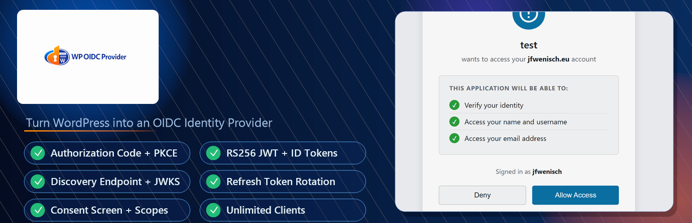

# Keystone OIDC

[](https://github.com/wenisch-tech/keystone-oidc/actions/workflows/ci.yml)
[](https://github.com/wenisch-tech/keystone-oidc/releases/latest)



> Turn your WordPress site into a fully featured **OpenID Connect (OIDC) identity provider**.


Keystone OIDC is a WordPress plugin that exposes standard OIDC / OAuth 2.0 endpoints so that other applications — dashboards, CLIs, mobile apps, or any OIDC-aware tool — can authenticate users against your existing WordPress user database.  
No external identity provider or third-party service is required.

---

## Table of Contents

- [Features](#features)
- [Requirements](#requirements)
- [Installation](#installation)
- [Quick Start](#quick-start)
- [Admin UI walkthrough](#admin-ui-walkthrough)
  - [Client list](#client-list)
  - [Add / Edit a client](#add--edit-a-client)
  - [Settings page](#settings-page)
- [How it works](#how-it-works)
  - [Authorization Code Flow](#authorization-code-flow)
  - [Token lifetimes](#token-lifetimes)
  - [PKCE support](#pkce-support)
  - [Signing keys](#signing-keys)
  - [Secret storage](#secret-storage)
- [OIDC Endpoint reference](#oidc-endpoint-reference)
- [Scopes & Claims](#scopes--claims)
- [Releases & CI pipeline](#releases--ci-pipeline)
- [Troubleshooting](#troubleshooting)
- [Contributing](#contributing)
- [License](#license)

---

## Features

| | |
|---|---|
| ✅ | **OIDC Authorization Code Flow** (RFC 6749 / OpenID Connect Core 1.0) |
| ✅ | **PKCE** – S256 and plain code-challenge methods (RFC 7636) |
| ✅ | **RS256 JWT** signed access tokens and ID tokens |
| ✅ | **Refresh tokens** with single-use rotation |
| ✅ | **OIDC Discovery** document (`/wenisch-tech/keystone-oidc/.well-known/openid-configuration`) for zero-config clients |
| ✅ | **JWKS endpoint** so clients can verify tokens without any shared secret |
| ✅ | **Multi-client management** – create and manage as many clients as needed |
| ✅ | **Client secret reset** – secrets shown only once, stored hashed |
| ✅ | **Consent screen** – users explicitly approve each application |
| ✅ | **Signing key rotation** from the admin panel |
| ✅ | **Automatic cleanup** of expired auth codes and revoked tokens |

---

## Requirements

| Requirement | Minimum version |
|---|---|
| WordPress | 5.6 |
| PHP | 7.4 |
| PHP extension | `openssl` |
| PHP extension | `json` |

Pretty permalinks must be **enabled** in WordPress (`Settings → Permalinks`). The plugin uses custom rewrite rules that do not work with the plain `?p=123` permalink structure.

---

## Installation

### Option A – Upload the ZIP (recommended)

1. Download the latest `keystone-oidc-x.y.z.zip` from the [Releases page](https://github.com/wenisch-tech/keystone-oidc/releases).
2. In your WordPress admin go to **Plugins → Add New → Upload Plugin**.
3. Choose the downloaded ZIP and click **Install Now**.
4. Click **Activate Plugin**.

### Option B – Manual file copy

1. Download and unzip the release archive.
2. Copy the `keystone-oidc` folder to `wp-content/plugins/`.
3. Activate the plugin in **Plugins → Installed Plugins**.

### What happens on activation

- Three database tables are created: `{prefix}oidc_clients`, `{prefix}oidc_auth_codes`, `{prefix}oidc_tokens`.
- A 2048-bit RSA key pair is generated and stored in WordPress options (private key encrypted via WordPress option storage; never exposed through any UI).
- Rewrite rules for all OIDC endpoints are flushed automatically.

---

## Quick Start

After activating the plugin you only need to do two things:

**1. Create a client**

Go to **OIDC Provider → Add Client** in the WordPress admin sidebar.

Fill in:
- **Application Name** – a friendly label (e.g. "My Dashboard")
- **Redirect URIs** – the callback URL(s) your application will use (one per line, e.g. `https://dashboard.example.com/auth/callback`)
- **Allowed Scopes** – tick `profile` and/or `email` if your app needs user info beyond the basic identity

Click **Create Client**. You will be shown the **Client ID** and **Client Secret** once – copy them now.

**2. Configure your application**

Point your OIDC client library at the discovery URL:

```
https://your-wordpress-site.example.com/wenisch-tech/keystone-oidc/.well-known/openid-configuration
```

Most OIDC libraries (e.g. `openid-client` for Node.js, `python-jose`, Keycloak adapters, Dex, etc.) will read this document and configure all endpoints automatically.

Provide the **Client ID** and **Client Secret** you copied in step 1, set the redirect URI to match what you registered, and request the `openid` scope (plus `profile` and/or `email` as needed).

That's it – your users can now sign in to external applications using their WordPress credentials.

---

## Admin UI walkthrough

### Client list

**OIDC Provider → Clients**

Displays all registered clients in a table with their name, client ID, allowed scopes, and creation date. The discovery URL is shown at the top of the page for convenience.

From the list you can click **Edit** to open a client's detail page.

### Add / Edit a client

**Add a client:** OIDC Provider → Add Client  
**Edit a client:** click **Edit** on the client list, or navigate to OIDC Provider → Clients and click a client name.

The edit screen has three sections:

**Client Credentials** (edit view only)
- Shows the **Client ID** with a copy button.
- Shows the discovery URL.
- Contains a **Reset Secret** button. Clicking it generates a new secret and invalidates the previous one. The new secret is displayed once on the following page.

**Configuration form**
- *Application Name* – displayed on the consent screen to users.
- *Redirect URIs* – the allowed callback URLs after authorization. One URI per line. Must be an exact match (no wildcard).
- *Allowed Scopes* – which scopes the client may request. `openid` is always included.

**Danger Zone**
- Permanently **Delete Client** and all its associated tokens.

### Settings page

**OIDC Provider → Settings**

Displays read-only information about the server:

- Issuer URL (the WordPress site URL)
- All endpoint URLs ready to copy
- Current signing key ID (`kid`)
- Plugin version

**Rotate Signing Keys** – generates a new RSA-2048 key pair. All previously issued access tokens and ID tokens will immediately become invalid. Use this after a suspected key compromise.

---

## How it works

### Authorization Code Flow

```
 Client App                WordPress (OIDC Provider)           User
     │                             │                             │
    │── GET /wenisch-tech/keystone-oidc/oauth/authorize ──── │                             │
     │   ?response_type=code       │                             │
     │   &client_id=…              │                             │
     │   &redirect_uri=…           │                             │
     │   &scope=openid profile     │                             │
     │   &state=…                  │                             │
     │                             │── redirect to wp-login ──── │
     │                             │   (if not logged in)        │
     │                             │                             │
     │                             │◄──── user logs in ──────── │
     │                             │                             │
     │                             │── show consent screen ───── │
     │                             │                             │
     │                             │◄── user clicks Allow ────── │
     │                             │                             │
     │◄── redirect to redirect_uri │                             │
     │    ?code=…&state=…          │                             │
     │                             │                             │
    │── POST /wenisch-tech/keystone-oidc/oauth/token ─────── │                             │
     │   grant_type=authorization_code                           │
     │   code=… redirect_uri=…     │                             │
     │   client_id=… client_secret=│                             │
     │                             │                             │
     │◄── access_token + id_token  │                             │
     │    + refresh_token ──────── │                             │
     │                             │                             │
    │── GET /wenisch-tech/keystone-oidc/oauth/userinfo ────── │                             │
     │   Authorization: Bearer …   │                             │
     │                             │                             │
     │◄── { sub, name, email, … }  │                             │
```

1. The client redirects the browser to `/wenisch-tech/keystone-oidc/oauth/authorize` with the standard parameters.
2. If the user is not logged in, WordPress's own login flow handles authentication and then redirects back to the authorize endpoint.
3. A consent screen lists the scopes being requested and asks the user to **Allow** or **Deny**.
4. On approval, a short-lived **authorization code** (valid 10 minutes, single-use) is issued and the browser is redirected to the client's `redirect_uri`.
5. The client's back-end exchanges the code for tokens by calling `/wenisch-tech/keystone-oidc/oauth/token` (server-to-server).
6. The plugin returns an **access token** (RS256 JWT), an **ID token** (RS256 JWT), and a **refresh token**.
7. The client can call `/wenisch-tech/keystone-oidc/oauth/userinfo` at any time with the Bearer access token to retrieve up-to-date user claims.

### Token lifetimes

| Token | Lifetime |
|---|---|
| Authorization code | 10 minutes |
| Access token (JWT) | 1 hour |
| ID token (JWT) | 1 hour |
| Refresh token | 30 days |

Refresh tokens use **single-use rotation**: each time a refresh token is used, it is revoked and a new one is issued alongside a fresh access token.

### PKCE support

[Proof Key for Code Exchange](https://datatracker.ietf.org/doc/html/rfc7636) protects public clients (e.g. SPAs, mobile apps) that cannot safely store a client secret.

When the authorization request includes a `code_challenge`, the plugin stores it alongside the auth code. The token endpoint then validates the `code_verifier` before issuing tokens. Both `S256` (SHA-256 hash, preferred) and `plain` methods are supported.

### Signing keys

On activation the plugin generates an RSA-2048 key pair using PHP's `openssl` extension. The private key is stored in the WordPress options table. The public key is published through the JWKS endpoint (`/wenisch-tech/keystone-oidc/oauth/jwks`) so that any client or resource server can verify tokens independently without trusting the plugin directly.

The key ID (`kid`) in each JWT header lets clients efficiently look up the correct key from the JWKS when multiple keys are present during rotation.

### Secret storage

Client secrets are **never stored in plaintext**. When a secret is created or reset, the plugin:

1. Generates a cryptographically random 64-character hex string.
2. Hashes it with WordPress's `wp_hash_password()` (bcrypt).
3. Stores only the hash in the database.
4. Displays the plaintext secret **once** in the admin UI via a short-lived (5-minute) transient.

After the page is loaded once, the plaintext is discarded and cannot be recovered — only reset.

---

## OIDC Endpoint reference

All URLs are relative to your WordPress site root (e.g. `https://example.com`).

| Endpoint | Method | Path |
|---|---|---|
| **Discovery** | GET | `/wenisch-tech/keystone-oidc/.well-known/openid-configuration` |
| **Authorization** | GET / POST | `/wenisch-tech/keystone-oidc/oauth/authorize` |
| **Token** | POST | `/wenisch-tech/keystone-oidc/oauth/token` |
| **UserInfo** | GET | `/wenisch-tech/keystone-oidc/oauth/userinfo` |
| **JWKS** | GET | `/wenisch-tech/keystone-oidc/oauth/jwks` |

### `GET /wenisch-tech/keystone-oidc/.well-known/openid-configuration`

Returns the [OIDC Discovery document](https://openid.net/specs/openid-connect-discovery-1_0.html) as JSON. Point your OIDC client library at this URL for automatic configuration.

```json
{
  "issuer": "https://example.com",
  "authorization_endpoint": "https://example.com/wenisch-tech/keystone-oidc/oauth/authorize",
  "token_endpoint": "https://example.com/wenisch-tech/keystone-oidc/oauth/token",
  "userinfo_endpoint": "https://example.com/wenisch-tech/keystone-oidc/oauth/userinfo",
  "jwks_uri": "https://example.com/wenisch-tech/keystone-oidc/oauth/jwks",
  "scopes_supported": ["openid", "profile", "email"],
  "response_types_supported": ["code"],
  "grant_types_supported": ["authorization_code", "refresh_token"],
  "id_token_signing_alg_values_supported": ["RS256"],
  "token_endpoint_auth_methods_supported": ["client_secret_basic", "client_secret_post"],
  "code_challenge_methods_supported": ["S256", "plain"]
}
```

### `GET /wenisch-tech/keystone-oidc/oauth/authorize`

Starts the authorization flow. Required parameters:

| Parameter | Required | Description |
|---|---|---|
| `response_type` | ✅ | Must be `code` |
| `client_id` | ✅ | The client's ID |
| `redirect_uri` | ✅ | Must exactly match a registered URI |
| `scope` | ✅ | Space-separated; must include `openid` |
| `state` | recommended | Opaque value echoed back to prevent CSRF |
| `nonce` | recommended | Included in the ID token to prevent replay |
| `code_challenge` | PKCE | Base64url-encoded challenge |
| `code_challenge_method` | PKCE | `S256` or `plain` |

### `POST /wenisch-tech/keystone-oidc/oauth/token`

Exchanges an authorization code or refresh token for tokens.

**Client authentication** – choose one:
- HTTP Basic Authentication: `Authorization: Basic base64(client_id:client_secret)`
- POST body parameters: `client_id` + `client_secret`

**Authorization Code grant** (`grant_type=authorization_code`):

| Parameter | Required | Description |
|---|---|---|
| `grant_type` | ✅ | `authorization_code` |
| `code` | ✅ | Authorization code from the authorize endpoint |
| `redirect_uri` | ✅ | Must match the value used in the authorize request |
| `client_id` | ✅ | |
| `code_verifier` | PKCE | Required if `code_challenge` was used |

**Refresh Token grant** (`grant_type=refresh_token`):

| Parameter | Required | Description |
|---|---|---|
| `grant_type` | ✅ | `refresh_token` |
| `refresh_token` | ✅ | The refresh token |
| `client_id` | ✅ | |

**Response:**

```json
{
  "access_token": "<JWT>",
  "token_type": "Bearer",
  "expires_in": 3600,
  "id_token": "<JWT>",
  "refresh_token": "<opaque string>",
  "scope": "openid profile email"
}
```

### `GET /wenisch-tech/keystone-oidc/oauth/userinfo`

Returns claims for the authenticated user. Requires a valid Bearer token.

```
Authorization: Bearer <access_token>
```

### `GET /wenisch-tech/keystone-oidc/oauth/jwks`

Returns the public RSA key in [JWKS format](https://datatracker.ietf.org/doc/html/rfc7517). Use this to verify RS256-signed JWTs without contacting the token endpoint.

---

## Scopes & Claims

| Scope | Claims included |
|---|---|
| `openid` | `sub`, `iss`, `aud`, `iat`, `exp`, `jti` |
| `profile` | `name`, `given_name`, `family_name`, `preferred_username` |
| `email` | `email`, `email_verified` |

The `sub` claim is always the WordPress user's numeric ID (as a string), ensuring stable, durable identity.

---

## Releases & CI pipeline

Every push to `main` automatically bumps the version (patch by default, following [Conventional Commits](https://www.conventionalcommits.org/)) via the [CI workflow](.github/workflows/ci.yml) which:

1. Computes the next semver tag and generates a changelog.
2. Patches the `Version:` header in `keystone-oidc.php` and `Stable tag:` in `readme.txt`.
3. Creates a `keystone-oidc-x.y.z.zip` archive with `keystone-oidc/` as the root folder (the layout WordPress expects).
4. Publishes a GitHub Release with the ZIP attached as a downloadable asset.

No manual tagging is required — just push to `main` and the pipeline handles everything.

The resulting ZIP can be uploaded directly via **Plugins → Add New → Upload Plugin** in WordPress.

---

## Troubleshooting

### Endpoints return 404

- Make sure **pretty permalinks are enabled** (`Settings → Permalinks`). Save the permalinks page once after activating the plugin to flush rewrite rules.
- If you recently activated the plugin and are still seeing 404s, visit `Settings → Permalinks` and click **Save Changes** to force a flush.

### "Invalid redirect_uri" error

The redirect URI in the authorization request must be an **exact match** (including scheme, host, path, and any trailing slash) with one of the URIs registered for the client. Check for trailing slashes and `http` vs `https` differences.

### "Invalid client" error

- The `client_id` does not exist. Double-check the value you configured in your application.
- If you recently deleted and recreated a client, update the client ID in your application.

### Tokens fail signature verification

The public key in the JWKS may have changed since the token was issued (e.g. after a key rotation). Fetch the JWKS again to get the current public key. Most well-behaved OIDC clients do this automatically when they encounter an unknown `kid`.

### "openssl not found" / keys not generating

Ensure the `openssl` PHP extension is installed and enabled. On most Linux distributions:

```bash
php -m | grep openssl
```

If missing, install it (e.g. `sudo apt-get install php-openssl` on Debian/Ubuntu) and restart your web server.

### Users are not redirected back after login

This can happen if WordPress's `wp_login_url()` filters the redirect URL. Ensure the `allowed_redirect_hosts` WordPress filter includes your site's domain, or that no security plugin is aggressively blocking redirect parameters.

---

## Contributing

1. Fork the repository and create a feature branch.
2. Make your changes following the [WordPress Coding Standards](https://developer.wordpress.org/coding-standards/wordpress-coding-standards/).
3. Open a pull request against `main`.

To create a development release, push a tag:

```bash
git tag v0.0.1-dev
git push origin v0.0.1-dev
```

---

## License

This plugin is licensed under the [GNU General Public License v2 or later](https://www.gnu.org/licenses/gpl-2.0.html), the same license as WordPress itself.
